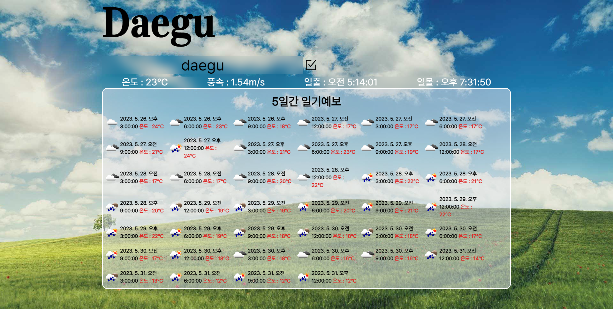

# 프로젝트 이름

   
  BroadCast

  
   

## 프로젝트 소개

프로젝트 개요/동기
 
openweather API를 사용하여 기상정보 & 일기예보 구현 

 

## STACK

Vue
 
TailwindCSs
 
Axios

## 구현 기능

### 기능 1
기본 위치를 서울로 설정, 기상예보를 원하는 도시의 도시명을 입력하여 기상정보 전환
### 기능 2
현재 기상정보에 맞추어 Background-image 변경
 
:style="{ backgroundImage: 'url(' + require(`@/assets/images/${weatherIcon}.jpg`) + ')' }"
### 기능 3
5일 간의 기상정보 제공
### 기능 4
반응형 구현
 

 

